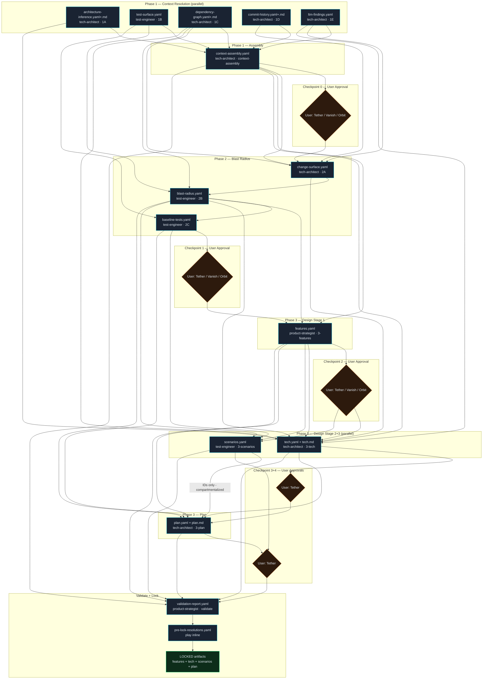

# Dependency Graph — prepare-implementation Play Neighborhood

**Task:** 1C-dependency-graph (SIMULATION)
**Issue:** 183
**Scope:** play → agents → skills → standards + STM artifact data flow

---

## Full Play Dependency Graph

```mermaid
graph TD
    %% ---- PLAY ----
    PI[prepare-implementation<br/>high-order play]

    %% ---- AGENTS ----
    TA[tech-architect<br/>opus · 8 tasks]
    TE[test-engineer<br/>opus · 4 tasks]
    PS[product-strategist<br/>opus · 2 tasks]
    DB[doc-builder<br/>sonnet · 3 tasks]
    RO[repo-orchestrator<br/>sonnet · 1 task]

    %% ---- SKILLS ----
    S1[draft-lld<br/>skill]
    S2[draft-verification-scenarios<br/>skill]
    S3[draft-product-spec<br/>skill]
    S4[validate-implementation-design<br/>skill]
    S5[research-domain-context<br/>skill · conditional]
    S6[briefs<br/>skill]
    S7[create-commit<br/>skill]

    %% ---- STANDARDS ----
    STD1[agent-contract.md<br/>standard]
    STD2[resolution-protocol.md<br/>standard]
    STD3[epic-management-rules.md<br/>standard]
    STD4[brief-principles.md<br/>standard]
    STD5[knowledge-file-template.md<br/>standard]

    %% ---- CONFIG / INTENT ----
    CFG[core/config.yaml]
    INT[reference/intent.yaml]
    LTM[~/.meridian/core/memory/]

    %% ---- PLAY DISPATCHES ----
    PI -->|dispatches 8 tasks| TA
    PI -->|dispatches 4 tasks| TE
    PI -->|dispatches 2 tasks| PS
    PI -->|dispatches utility| DB
    PI -->|dispatches utility| RO

    %% ---- PLAY READS ----
    PI -->|reads pre-flight| CFG
    PI -->|reads constraints| INT

    %% ---- AGENTS INVOKE SKILLS ----
    TA -->|invokes| S1
    TE -->|invokes| S2
    PS -->|invokes| S3
    PS -->|invokes| S4
    PS -.->|invokes conditional| S5
    DB -->|invokes| S6
    RO -->|invokes| S7

    %% ---- AGENTS READ LTM ----
    TA -->|queries 1E-ltm-consultation| LTM
    PS -->|queries schema lookup| LTM

    %% ---- STANDARDS GOVERNANCE ----
    STD1 -.->|governs| PI
    STD1 -.->|governs| TA
    STD1 -.->|governs| TE
    STD1 -.->|governs| PS
    STD1 -.->|governs| DB
    STD1 -.->|governs| RO

    STD2 -.->|governs R1-R4| TA
    STD2 -.->|governs R1-R4| PS
    STD2 -.->|governs R1-R4| RO

    STD3 -.->|governs vertical slices| PI
    STD3 -.->|governs vertical slices| PS
    STD3 -.->|governs phase structure| TA

    STD4 -.->|governs| DB
    STD4 -.->|governs| PI

    STD5 -.->|governs LTM reads| TA

    %% ---- STYLING ----
    classDef play fill:#0D2D4A,stroke:#00D4FF,color:#E0E8F0
    classDef domain_agent fill:#1A2332,stroke:#00D4FF,color:#E0E8F0
    classDef util_agent fill:#1A2332,stroke:#555,color:#999
    classDef skill fill:#1A2332,stroke:#E8731A,color:#E0E8F0
    classDef standard fill:#1A2332,stroke:#FF3CAC,color:#E0E8F0
    classDef config fill:#1A2332,stroke:#666,color:#999
    classDef ltm fill:#2D1A0D,stroke:#E8731A,color:#E0E8F0

    class PI play
    class TA,TE,PS domain_agent
    class DB,RO util_agent
    class S1,S2,S3,S4,S5,S6,S7 skill
    class STD1,STD2,STD3,STD4,STD5 standard
    class CFG,INT config
    class LTM ltm
```



---

## STM Artifact Data Flow

The following graph shows how intermediate artifacts flow between agents across play phases.



---

## Agent Task Dispatch Map

| Agent | Type | Tasks Dispatched | Budget |
|-------|------|-----------------|--------|
| `tech-architect` | domain | 1A, 1C, 1D, 1E, context-assembly, 2A, 3-tech, 3-plan | counts toward L2 ≤5 domain budget |
| `test-engineer` | domain | 1B, 2B, 2C, 3-scenarios | counts toward L2 ≤5 domain budget |
| `product-strategist` | domain | 3-features, validate | counts toward L2 ≤5 domain budget |
| `doc-builder` | utility | brief-features, brief-tech, brief-scenarios-plan | **exempt** from domain budget |
| `repo-orchestrator` | utility | evidence-commit | **exempt** from domain budget |

Note: The L2 agent budget applies to domain agents only. The `tech-architect` is dispatched 8 times — each dispatch is a separate invocation of the same agent with a different task_id, not 8 concurrent agents. The budget constraint counts unique domain agent types (3), not dispatch count.

---

## Coupling Clusters

### Cluster 1: Phase 1 Parallel Fan-out (no coupling)

```
pre-flight
    ├── 1A: architecture-inference  (tech-architect)
    ├── 1B: test-surface-mapping    (test-engineer)
    ├── 1C: dependency-graph        (tech-architect)
    ├── 1D: git-history             (tech-architect)
    └── 1E: ltm-consultation        (tech-architect)
```

All five are independent. No data dependency between them. Safe to run in parallel.

### Cluster 2: Context Assembly Convergence (high fan-in)

```
stm-architecture-inference ─┐
stm-test-surface            ─┤
stm-dependency-graph        ─┼─→ context-assembly.yaml
stm-commit-history          ─┤        (tech-architect)
stm-ltm-findings            ─┘
```

**Risk:** Any Phase 1 failure propagates to context-assembly and blocks the entire pipeline. This is the highest-risk node — if any parallel Phase 1 agent fails, Checkpoint 0 cannot proceed.

### Cluster 3: Blast Radius Sequential Chain

```
context-assembly → change-surface → blast-radius → baseline-tests
(tech-architect)   (tech-architect)  (test-engineer)  (test-engineer)
```

Strictly sequential. Each step gates the next. Agent handoff between tech-architect (2A) and test-engineer (2B) is a boundary — test-engineer must not perform architecture inference (C32).

### Cluster 4: Compartmentalization Constraint (scenarios → plan)

```
scenarios.yaml ──[IDs only]──→ plan.yaml
(test-engineer)                (tech-architect)
```

This is a **coupling constraint, not a data dependency**. The plan reads scenarios.yaml but is forbidden from reading scenario descriptions, expected_behavior, or pass_criteria. Only IDs and counts flow across. Violation = F8.

---

## Fan-in Hotspot Summary

| Node | Consumed By | Risk |
|------|-------------|------|
| `context-assembly.yaml` | change-surface, features, tech, plan, validate | HIGH — blocks entire pipeline if absent |
| `blast-radius.yaml` | baseline-tests, features, tech, scenarios, plan | HIGH — central to Phase 2+3 |
| `features.yaml` | tech, scenarios, plan, validate | MEDIUM — feeds all Stage 3 artifacts |
| `dependency-graph.yaml` | context-assembly, change-surface, blast-radius | MEDIUM — used across phases |
| `tech-architect` (agent) | 8 task invocations | MEDIUM — bottleneck if agent fails |

---

## Standards Governance Map

| Standard | Governs |
|----------|---------|
| `agent-contract.md` | All agents in the play (universal protocol) |
| `resolution-protocol.md` | tech-architect (1E LTM), product-strategist, repo-orchestrator |
| `epic-management-rules.md` | prepare-implementation (C6/F3), product-strategist (features.yaml), tech-architect (plan phases) |
| `brief-principles.md` | doc-builder (all briefs), prepare-implementation (checkpoint review presentation) |
| `knowledge-file-template.md` | tech-architect (1E: reads LTM files conforming to this schema) |
| `templates/epic-schema.md` | product-strategist (features.yaml schema conformance) |

---

## Key Design Observations

1. **tech-architect is the weight-bearing column.** It owns 8 of 13 play tasks spanning all phases. It is the only agent producing architecture inference, dependency graphs, change surface, tech design, and execution plan. A failure in this agent propagates to 80% of all intermediate artifacts.

2. **Compartmentalization is a first-class coupling constraint.** The scenarios→plan edge is not just a data flow — it carries a hard restriction (C9, F8). Scenarios content must never appear in plan.yaml. This is enforced at the artifact schema level, not the agent level.

3. **context-assembly.yaml is the critical path bottleneck.** It aggregates all 5 Phase 1 outputs and is consumed by all Phase 2 and Phase 3 agents. Any Phase 1 failure — in any of the 5 parallel steps — blocks the entire pipeline at Checkpoint 0.

4. **Standards govern the contract schema, not just the content.** `agent-contract.md` is the universal envelope that every play→agent invocation must follow. It is not an implementation detail — it is the interface contract that makes the agent composition work.

5. **doc-builder and repo-orchestrator are exempt from L2 budget.** The L2 ≤5 domain agent constraint applies to tech-architect, test-engineer, and product-strategist. Utility agents run outside that budget.
