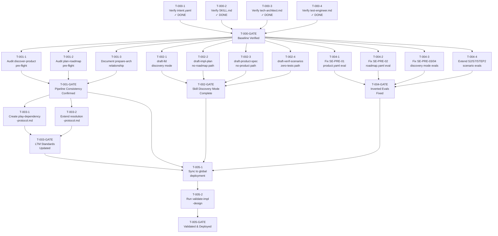

# Implementation Plan — Issue #183
## prepare-implementation should not hard-block on product.yaml and roadmap.yaml

**Status:** DRAFT  
**Date:** 2026-03-31  
**Total Tasks:** 23 (4 already completed on branch)  
**Total Files Changed:** 14  

---

## Phase Flow

```
Phase 0: Baseline Verification    ← COMPLETED ON BRANCH
    [T-000-1] intent.yaml verified  ✓
    [T-000-2] SKILL.md verified      ✓
    [T-000-3] tech-architect.md      ✓
    [T-000-4] test-engineer.md       ✓
          |
          v
    [T-000-GATE] ─────────────────────────────────────┐
          |                                            |
          |         (parallel fan-out)                 |
          ├──────────────────────┬────────────────────┤
          v                      v                    v
    Feature 1                Feature 2            Feature 4
    Pipeline                 Downstream           Eval Update
    Consistency              Skills               (Inverted Evals)
    [T-001]                  [T-002]              [T-004]
          |                      |                    |
          v                      v                    v
    [T-001-GATE]           [T-002-GATE]          [T-004-GATE]
          |                                          |
          ├──────────────────────┐                   |
          v                      v                   |
    Feature 3                   |                    |
    LTM Standards               |                    |
    [T-003]                     |                    |
          |                     |                    |
          v                     |                    |
    [T-003-GATE]                |                    |
          └────────────────────┬┴────────────────────┘
                               v
                         Feature 5
                         Sync & Validate
                         [T-005]
                               |
                               v
                         [T-005-GATE]
                         DONE
```

---

## Full Task DAG (Mermaid)



---

## Feature Breakdown

### Phase 0 — Baseline Verification (COMPLETED)

All 4 tasks already applied on `feat/182-ltm-resolution-protocol`.

| Task | File | Status |
|------|------|--------|
| T-000-1 | reference/intent.yaml | Done |
| T-000-2 | prepare-implementation/SKILL.md | Done |
| T-000-3 | agents/tech-architect.md | Done |
| T-000-4 | agents/test-engineer.md | Done |

**Gate criteria:** 13/17 baseline tests pass on current code.  
4 tests (BT-AGT-01, BT-AGT-02, BT-AGT-03, BT-SKL-01) need direct file verification.

---

### Feature 1 — Pipeline Play Consistency

**Can start:** After T-000-GATE  
**Can run in parallel with:** Feature 2, Feature 4

Three pipeline plays must be consistency-checked per the co-change law
(commit history shows all 4 pipeline plays update together on cross-cutting changes).

| Task | File | Action | Likely Outcome |
|------|------|--------|----------------|
| T-001-1 | discover-product/SKILL.md | MODIFY or no-op | Intentionally harder (upstream step) — likely no-op |
| T-001-2 | plan-roadmap/SKILL.md | MODIFY or no-op | Dependency chain verify — likely no-op |
| T-001-3 | prepare-architecture/SKILL.md | MODIFY | Add relationship note — prepare-impl runs without it |

**Key question resolved here:** Are discover-product and plan-roadmap's pre-flight hard-blocks
intentionally stricter than prepare-implementation? If yes: document the intent. If no: relax them.

---

### Feature 2 — Downstream Skill Discovery Mode

**Can start:** After T-000-GATE  
**Can run in parallel with:** Feature 1, Feature 4  
**All 4 tasks are independent of each other — fully parallel**

| Task | File | Discovery Mode Required |
|------|------|------------------------|
| T-002-1 | draft-lld/SKILL.md | Absent architecture.yaml → infer from codebase scan |
| T-002-2 | draft-implementation-plan/SKILL.md | Absent roadmap.yaml → construct from issue + codebase |
| T-002-3 | draft-product-spec/SKILL.md | Absent product.yaml → derive from issue + codebase + R4 |
| T-002-4 | draft-verification-scenarios/SKILL.md | Zero tests → eval-based reinterpretation |

**Highest risk task:** T-002-4 (zero-tests reinterpretation). This is a new pattern with
no prior art in meridian-os skill definitions.

---

### Feature 3 — LTM Standards Creation

**Can start:** After T-001-GATE (depends on Feature 1 completing first)  
**Rationale:** The new LTM standard must be consistent with what was verified in Feature 1 about
the pipeline play soft-dependency philosophy. Feature 1 determines the authoritative semantics;
Feature 3 codifies them.

| Task | File | Content |
|------|------|---------|
| T-003-1 | memory/standards/play-dependency-protocol.md | NEW — hard-halt vs soft-degrade rules, authority hierarchy, checkpoint messaging |
| T-003-2 | memory/standards/rules/resolution.md | EXTEND — document C23 as play-level R1-R4 parallel |

**Design constraint:** play-dependency-protocol.md must follow knowledge-file-template.md
(Tier 1 + Tier 2 metadata). It is a new standard, not a knowledge file — place in `standards/`
not `knowledge/`.

---

### Feature 4 — Eval Update (Fix Inverted Evals)

**Can start:** After T-000-GATE  
**Can run in parallel with:** Feature 1, Feature 2

This is the highest-severity work item. 3 critical evals have inverted pass/fail conditions
identified in blast-radius.yaml.

```
Severity breakdown:
  CRITICAL (3): SE-PRE-01, SE-PRE-02, SE-STEP0-01
  HIGH     (2): SE-PRE-03, SE-PRE-04
  MEDIUM   (3): SE-STEP2-01, SCE-S2-01, SCE-S7-01
```

All eval changes are modifications to `reference/intent.yaml`. They can be batched:

| Task | Evals Fixed | Severity |
|------|-------------|----------|
| T-004-1 | SE-PRE-01 | CRITICAL |
| T-004-2 | SE-PRE-02 | CRITICAL |
| T-004-3 | SE-PRE-03, SE-PRE-04, SE-STEP0-01 | CRITICAL + HIGH |
| T-004-4 | SE-STEP2-01, SCE-S2-01, SCE-S7-01 | MEDIUM |

**Note:** T-004-1 through T-004-4 all modify `reference/intent.yaml`. They could be
sequenced in one pass rather than 4 file edits — but are kept separate for exit gate
clarity and verification traceability.

---

### Feature 5 — Sync and Validate

**Can start:** After ALL of Features 1, 2, 3, 4 complete  
**This is the convergence point of all parallel tracks**

| Task | Action |
|------|--------|
| T-005-1 | /sync-claude — deploy all updated components to ~/.claude/ and ~/.meridian/ |
| T-005-2 | /validate-implementation-design — cross-validate all artifacts |

---

## Critical Path

The critical path is the longest sequence of dependent tasks:

```
T-000-GATE
    → T-001-1/2/3 (parallel, ~1 each)
    → T-001-GATE
    → T-003-1 + T-003-2 (parallel)
    → T-003-GATE
    → T-005-1
    → T-005-2
    → T-005-GATE
```

**Critical path length:** 6 sequential steps (after Phase 0)

Feature 2 and Feature 4 are NOT on the critical path — they can run in parallel with Feature 1
and must complete before T-005-1, but they do not block Feature 3.

---

## Parallel Execution Opportunities

After T-000-GATE, three tracks can proceed simultaneously:

```
Track A (Critical Path):   T-001 → T-001-GATE → T-003 → T-003-GATE
Track B (Parallel):        T-002-1 + T-002-2 + T-002-3 + T-002-4 → T-002-GATE
Track C (Parallel):        T-004-1 + T-004-2 + T-004-3 + T-004-4 → T-004-GATE
```

Within Track B, all 4 tasks (T-002-1 through T-002-4) are independent and fully parallel.  
Within Track C, all 4 tasks (T-004-1 through T-004-4) are independent of each other but
share one target file (intent.yaml) — sequence them within the same file edit session.

---

## File Change Summary

| File | Feature | Action | Status |
|------|---------|--------|--------|
| core/components/plays/prepare-implementation/reference/intent.yaml | Phase 0, F4 | MODIFY | Phase 0 done; F4 remaining |
| core/components/plays/prepare-implementation/SKILL.md | Phase 0 | MODIFY | DONE |
| core/components/agents/tech-architect.md | Phase 0 | MODIFY | DONE |
| core/components/agents/test-engineer.md | Phase 0 | MODIFY | DONE |
| core/components/plays/discover-product/SKILL.md | F1 | MODIFY/no-op | Pending |
| core/components/plays/plan-roadmap/SKILL.md | F1 | MODIFY/no-op | Pending |
| core/components/plays/prepare-architecture/SKILL.md | F1 | MODIFY | Pending |
| core/components/skills/draft-lld/SKILL.md | F2 | MODIFY | Pending |
| core/components/skills/draft-implementation-plan/SKILL.md | F2 | MODIFY | Pending |
| core/components/skills/draft-product-spec/SKILL.md | F2 | MODIFY | Pending |
| core/components/skills/draft-verification-scenarios/SKILL.md | F2 | MODIFY | Pending |
| core/components/memory/standards/play-dependency-protocol.md | F3 | CREATE | Pending |
| core/components/memory/standards/rules/resolution.md | F3 | MODIFY | Pending |
| ~/.claude/ (deployed targets) | F5 | MODIFY (sync) | Pending |

---

## Risk Register

| Risk | Severity | Mitigation |
|------|----------|-----------|
| discover-product/plan-roadmap pre-flight changes may cascade to other issues | Medium | Read before modifying; validate changes are bounded to consistency notes |
| intent.yaml receives 4 separate edits across F4 tasks — merge risk | Low | Batch all eval fixes into a single edit session for T-004 |
| play-dependency-protocol.md may overlap with existing agent-contract.md scope | Low | Scope protocol to play-level behavior; agent-contract.md covers agent-level |
| validate-implementation-design may surface new constraint violations post-edit | Medium | Exit gate for T-005-2 requires passing; if fails, add recovery tasks |
| 4 BT-AGT tests in baseline-tests.yaml still show null pass status | Medium | Verify agent definitions in T-000-3/4 exit gates before marking complete |

---

## Scenario Gate Summary

| Gate | Scenarios | Count |
|------|-----------|-------|
| T-000-GATE | S2, S7, S13 | 3 |
| T-001-GATE | S7, S10 | 2 |
| T-002-GATE | S8, S10, S11, S12 | 4 |
| T-003-GATE | S2, S9 | 2 |
| T-004-GATE | S1, S2, S4, S5, S6, S7, S8, S10, S12, S13 | 10 |
| T-005-GATE | S1–S13 (all) | 13 |
