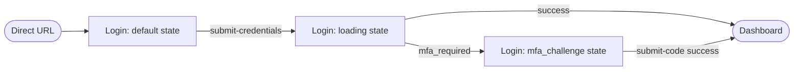
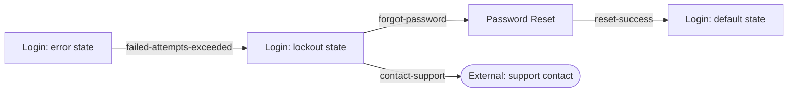

# map-user-flows

> **Defect 23 — Decision Surfacing Discipline (DSD):** This skill emits a `decision-manifest.yaml` alongside its primary artifact. Every inferred decision produced during execution is recorded in the manifest with tier, grounding source, recommendation, and alternatives. The orchestrator drives the tiered surfacing flow after this skill completes.

Called by `designer` during `design` Stage 3. Produces one Markdown file per flow under `{product_base}experience/flows/`.

## Purpose

For every persona journey implied by the intent epics' success and failure scenarios, produce a Mermaid flow diagram that traces screens from entry to exit. Happy-path flows cover success scenarios; recovery flows cover failure scenarios. Every flow is traceable to a specific persona and a specific scenario ID.

## Input

Receive from the designer agent. All paths resolve against `{product_base}` supplied by the play via the JSON contract — do not hard-code `.garura/product/` or assume a working directory.

- `personas_path` (path, required) — typically `{product_base}experience/personas.md`
- `screens_dir` (path, required) — typically `{product_base}experience/screens/`
- `epics_dir` (path, required) — typically `{product_base}scope/epics/`
- `flows_dir` (string, required) — typically `{product_base}experience/flows/`
- `decision_manifest_path` (path, required) — path for the `decision-manifest.yaml` output, written alongside the primary artifacts (e.g., `{product_base}experience/decision-manifest-map-user-flows.yaml`). Exact path is passed by the calling agent.

## Process

Resolve each input path by substituting `{product_base}` from the incoming JSON contract; do not re-prefix with `.garura/product/` or assume a working directory.

### 1. Load inputs

- Read `personas.md` → persona list with capability mapping.
- Glob `{screens_dir}/*.md` → parse each screen's frontmatter (id, capability, name) and `## Navigation` section (entry/exit points).
- Glob `{epics_dir}/*.yaml` → parse each epic's `success_scenarios` and `failure_scenarios`.

### 2. Build the flow graph

For each (persona, capability) pair, assemble a directed graph of screens:
- Nodes = screen IDs (from frontmatter)
- Edges = navigation exit_points → corresponding screen's entry_points
- Starting nodes = screens whose entry_points include external entry (`direct-url`, `entry-from-external`)
- Terminal nodes = screens whose exit_points reference a named dashboard / out-of-play destination

### 3. For each scenario, derive a flow

Walk the `success_scenarios` and `failure_scenarios` of each epic:

**Success scenario → happy-path flow:**
- Pick the persona that matches the scenario's described actor.
- Trace from the persona's typical entry point through the screens that satisfy the scenario's outcome.
- Produce a Mermaid diagram.

**Failure scenario → recovery flow:**
- Start from the screen where the failure manifests (error state).
- Trace the recovery path: error → retry action → success screen OR alternative recovery screen.
- If the epic specifies a specific recovery (from the `Mitigation:` sub-field), prefer that path.

### 3b. Emit decision manifest

Before writing any flow file, write `decision-manifest.yaml` to `{decision_manifest_path}`.

Record every inferred decision produced during Steps 2 and 3. Assign tier at runtime based on grounding source: **high** when the decision was a direct match against a KB rule, file, or catalog entry; **mid** when context was built via web research; **low** when neither KB nor research yielded a grounding source.

**Decisions to record** (decision_id prefix: `D-muf-`):

| decision_id | decision_type | What is being decided |
|-------------|---------------|-----------------------|
| `D-muf-001` | `persona-scenario-assignment` | For each success scenario, which persona is identified as the driving actor based on text similarity to persona job stories (Step 3) |
| `D-muf-002` | `screen-sequence-trace` | For each success scenario, the ordered sequence of screens traced from entry point to scenario completion (Step 3) |
| `D-muf-003` | `recovery-path-design` | For each failure scenario, the recovery screen sequence designed from the error state to resolution (including any inferred intermediate screens when the mitigation field is vague) (Step 3) |

```yaml
schema_version: "1.0"
skill: "map-user-flows"
generated_at: "{ISO8601}"
decisions:
  - decision_id: "D-muf-001"
    decision_type: "persona-scenario-assignment"
    tier: high | mid | low   # assign at runtime per grounding source
    grounding_source:
      kind: kb_path | web_citation | none
      ref: "{KB file path | URL | null}"
      excerpt: "{optional short quote when kind=kb_path}"
    recommendation: "{the persona assigned to the scenario}"
    alternatives_considered:
      - alt: "{alternative persona}"
        why_not: "{one-line dismissal reason}"
    agent_reasoning_summary: "{2-3 sentence explanation}"
    user_response: null
    user_response_detail: null
  # ... one entry per decision listed above (repeat per scenario for D-muf-001 through D-muf-003)
```

### 4. Write one MD file per flow

```markdown
---
id: FLOW-user-login-happy-path
persona: end-user
capability: UM-F001
source_scenario: EPIC-user-login-001/success_scenarios[0]
flow_type: success
---

# Login — Happy Path (end-user)

**Scenario:** User logs in successfully on first attempt.
**Evidence:** Login success rate > 95% on first attempt.

## Flow



## Screens referenced

- `SCR-user-login-primary` (default, loading, mfa_challenge states)

## Annotations

- The `mfa_challenge` branch only fires when the user has MFA enrolled (UM-F004 selected).
- Dashboard is out of scope for this flow — the flow terminates at the successful redirect.
```

And for a recovery flow:

```markdown
---
id: FLOW-user-login-lockout-recovery
persona: end-user
capability: UM-F001
source_scenario: EPIC-user-login-001/failure_scenarios[0]
flow_type: recovery
---

# Login — Lockout Recovery

**Failure scenario:** Account locked with no visible recovery path.
**Mitigation:** Always show forgot-password and contact-support links on the locked-out screen.

## Flow



## Screens referenced

- `SCR-user-login-primary` (error, lockout, default states)
- `SCR-user-password-reset` (primary state)

## Annotations

- Lockout timer counts down on the lockout state; the user cannot retry until it expires or they reset via password-reset.
- Support channel is external to the product — the flow terminates there.
```

### 5. Return output contract

```yaml
flows:
  flows_dir: <path>
  total_flows: <int>
  success_flows: <int>
  recovery_flows: <int>
  coverage:
    success_scenarios_total: <int>
    success_scenarios_with_flow: <int>
    failure_scenarios_total: <int>
    failure_scenarios_with_recovery: <int>
    orphan_scenarios: []  # must be empty
decision_manifest:
  path: <written path>
  decisions_recorded: <int>
```

## Constraints

- NEVER skip a success scenario. Every success scenario across every epic has at least one flow referencing it.
- NEVER skip a failure scenario. Every failure scenario has at least one recovery flow.
- NEVER reference screens that don't exist in `screens_dir`. Every screen ID in every flow must resolve.
- NEVER produce flows without `source_scenario` frontmatter — that's how traceability is maintained.
- NEVER use free-form prose diagrams. Always use Mermaid `flowchart` syntax so the diagrams are renderable.
- ALWAYS name nodes using actual screen IDs + state names (`SCR_user_login_primary_default`), with underscores replacing hyphens for Mermaid compatibility.
- ALWAYS include "Screens referenced" and "Annotations" sections for human reviewers.
- NEVER commit an inferred decision to the primary artifacts (flow MD files) without recording it in `decision-manifest.yaml` first.
- NEVER tag a decision `tier: high` unless the `grounding_source.kind` is `kb_path` AND the referenced KB file exists.
- ALWAYS include `alternatives_considered` (≥1 entry) for every decision, even high-confidence ones.

## Version

| Field | Value |
|-------|-------|
| Version | 0.2.0 |
| Category | ux-design |
| Created | 2026-04-14 |
| Related | `core/components/skills/generate-screen-inventory`, `core/components/skills/validate-screen-coverage` |
